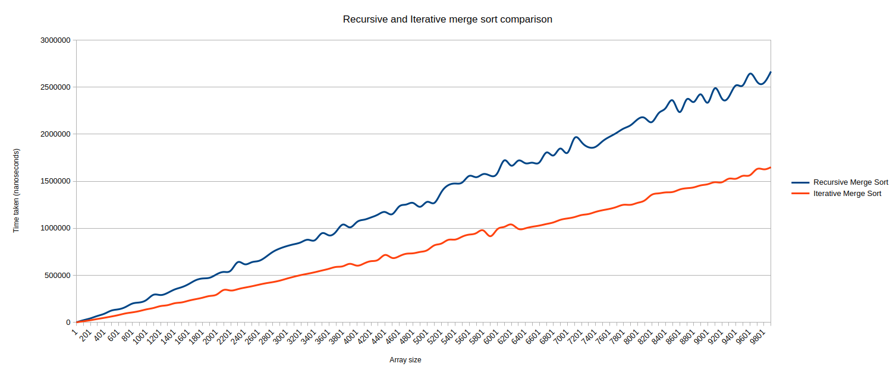

# DataStructures-and-Algorithms
Common Data structures and Algorithms programmed by me as a practice exercise

## Available Algorithms
### Sorting algorithms
- Insertion sort
- Bubble sort
- Optimized bubble sort
- Selection sort
- Iterative merge sort
- Recursive merge sort

## Sorting algorithm comparison

#### Insertion sort, Bubble Sort and Selection sort comparison

#### Merge sort: iterative vs recursive comparison

